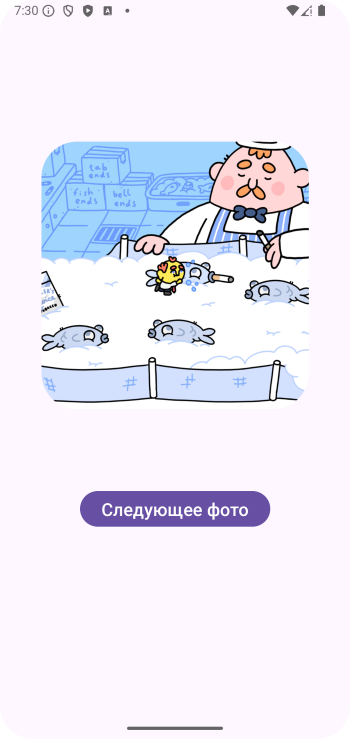
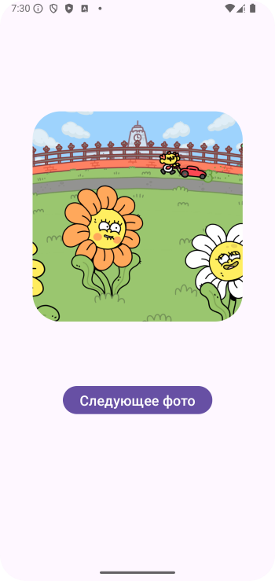
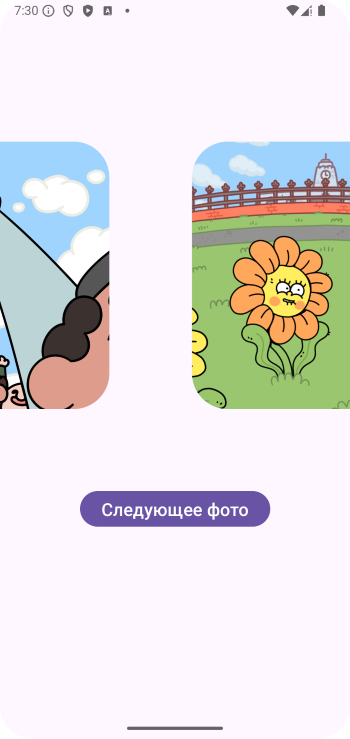
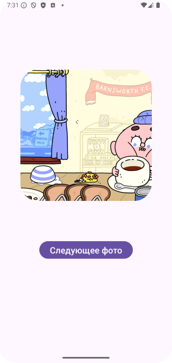
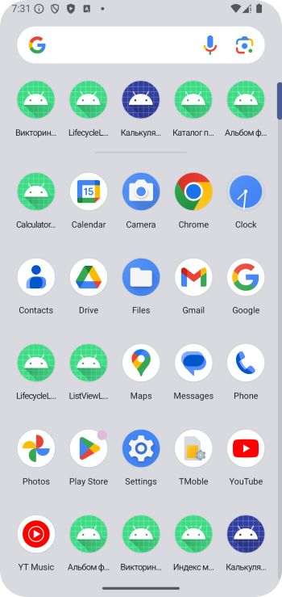

# Домашнее задание по теме "ImageView"

### Приложение «Альбом фотографий»

Создать приложение для демонстрации фотографий. При запуске приложения на стартовом экране высвечивается заголовок альбома, и кнопка **«Начать просмотр»**. По нажатию на нее происходит переход на основной экран демонстрации фото и там уже отображается первое фото альбома. По нажатие на кнопку **«Следующее фото»** происходит их смена. Когда фото в альбоме кончатся происходит переход на финальный экран, на котором в качестве заголовка выходит фраза **«Спасибо за просмотр! До свидания»**

Для работы приложения необходимо создать:

На первом экране:

1. Заголовок **«Вас приветствует альбом любимых фотографий»** (название может быть своим).

2. Кнопка **«Начать просмотр»**.

На втором экране:

1. `ImageView`, в котором по нажатию на кнопку, указанную ниже, будут располагаться соответствующие фотографии. Допустим, планируется показ пяти фотографий.

2. Кнопка **«Следующее фото»**.

На третьем экране:

1. Заголовок **«Спасибо за просмотр! До свидания»**.

2. Кнопка или пункт меню для завершения работы приложения.

Приложение необходимо сохранить проектом в удаленном репозитории, для проверки качества предоставить ссылку преподавателю, либо сделать скрины эмулятора при каждом шаге работы приложения.

### Скриншоты домашнего задания

Скриншоты домашнего задания

